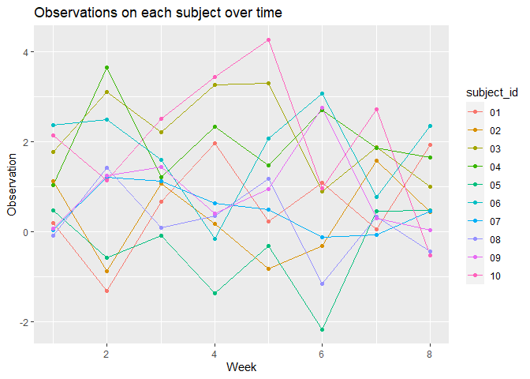

Homework 5
================
Hongjie Liu

Load necessary packages for homework 5.

``` r
library(tidyverse)
```

## Problem 1

Load and tidy dataset.

``` r
arm_df = list.files(path = "./data/", pattern = "^[ce]", full.names = T) %>% 
  map(~ read_csv(.x) %>% 
        mutate(arm = .x)) %>% 
  bind_rows %>% 
  pivot_longer(
    cols = week_1:week_8,
    names_to = "week",
    names_prefix = "week_",
    values_to = "observation"
  ) %>% 
  mutate(
    week = as.numeric(week),
    arm = str_extract(arm, "[a-z]{3}_[0-9]{2}")
  ) %>% 
  separate(arm, into = c("arm", "subject_id"), sep = "_") %>% 
  filter(arm == "con")
```

Make a spaghetti plot showing observations on each subject over time,
and comment on differences between groups.

``` r
arm_df %>% 
  ggplot(aes(x = week, y = observation, color = subject_id)) +
  geom_line() +
  geom_point() +
  labs(
    title = "Observations on each subject over time",
    x = "Week",
    y = "Observation"
  )
```

<!-- -->

## Problem 2

The data includes information of more than 52,000 criminal homicides
over the past decade in 50 of the largest American cities. The raw data
includes:

-   uid;
-   reported date;
-   basic demographic information about each victim, including first
    name, last name, race, age, and sex;
-   the location of the killing, including state, city, longitude, and
    latitude;
-   whether an arrest was made.

Create a city_state variable and then summarize within cities to obtain
the total number of homicides and the number of unsolved homicides
(those for which the disposition is “Closed without arrest” or “Open/No
arrest”). We assign the resulting dataset to `homicide_df`. We change
one value of `city_state`, `Tulsa, AL`, to `Tulsa, OK`, because Tulsa is
a city in Oklahoma, and the values of `uid`, `lat`, and `lon` indicate
that the state should be `OK`.

``` r
homicide_df =
  read_csv("./data/homicide-data.csv") %>% 
  unite(city_state, city:state, sep = ", ") %>% 
  mutate(city_state = replace(city_state, city_state == "Tulsa, AL", "Tulsa, OK")) %>% 
  group_by(city_state) %>% 
  summarize(
    n_obs = n(),
    n_unsolved_obs = sum(disposition %in% c("Closed without arrest", "Open/No arrest"))
  )

homicide_df
```

    ## # A tibble: 50 × 3
    ##    city_state      n_obs n_unsolved_obs
    ##    <chr>           <int>          <int>
    ##  1 Albuquerque, NM   378            146
    ##  2 Atlanta, GA       973            373
    ##  3 Baltimore, MD    2827           1825
    ##  4 Baton Rouge, LA   424            196
    ##  5 Birmingham, AL    800            347
    ##  6 Boston, MA        614            310
    ##  7 Buffalo, NY       521            319
    ##  8 Charlotte, NC     687            206
    ##  9 Chicago, IL      5535           4073
    ## 10 Cincinnati, OH    694            309
    ## # … with 40 more rows

For the city of Baltimore, MD, we use the `prop.test` function to
estimate the proportion of homicides that are unsolved; save the output
of `prop.test` as an R object `unsolved_prop_bal`, apply the
`broom::tidy` to this object and pull the estimated proportion and
confidence intervals from the resulting tidy dataframe.

``` r
unsolved_prop_bal =
  prop.test(
    pull(filter(homicide_df, city_state == "Baltimore, MD"), n_unsolved_obs),
    pull(filter(homicide_df, city_state == "Baltimore, MD"), n_obs)
  )

unsolved_prop_bal %>% 
  broom::tidy() %>% 
  select(estimate, conf.low, conf.high)
```

    ## # A tibble: 1 × 3
    ##   estimate conf.low conf.high
    ##      <dbl>    <dbl>     <dbl>
    ## 1    0.646    0.628     0.663

Now run `prop.test` for each of the cities in your dataset, and extract
both the proportion of unsolved homicides and the confidence interval
for each. We create a tidy dataframe `unsolved_df` with estimated
proportions and CIs for each city.

``` r
unsolved_df =
  homicide_df %>% 
  mutate(
    htest = 
      map2(
        .x = n_unsolved_obs, .y = n_obs,
        ~ prop.test(x = .x, n = .y) %>% 
          broom::tidy()
      )
  ) %>% 
  unnest(htest) %>% 
  janitor::clean_names() %>% 
  select(city_state, estimate, conf_low, conf_high)

unsolved_df
```

    ## # A tibble: 50 × 4
    ##    city_state      estimate conf_low conf_high
    ##    <chr>              <dbl>    <dbl>     <dbl>
    ##  1 Albuquerque, NM    0.386    0.337     0.438
    ##  2 Atlanta, GA        0.383    0.353     0.415
    ##  3 Baltimore, MD      0.646    0.628     0.663
    ##  4 Baton Rouge, LA    0.462    0.414     0.511
    ##  5 Birmingham, AL     0.434    0.399     0.469
    ##  6 Boston, MA         0.505    0.465     0.545
    ##  7 Buffalo, NY        0.612    0.569     0.654
    ##  8 Charlotte, NC      0.300    0.266     0.336
    ##  9 Chicago, IL        0.736    0.724     0.747
    ## 10 Cincinnati, OH     0.445    0.408     0.483
    ## # … with 40 more rows
