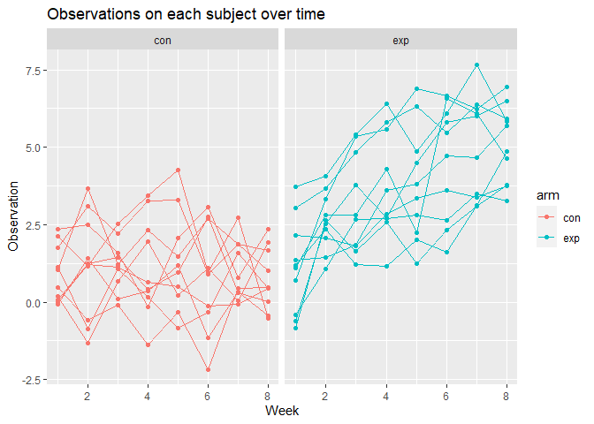

Homework 5
================
Hongjie Liu

Load necessary packages for homework 5.

``` r
library(tidyverse)
```

## Problem 1

Load and tidy dataset.

``` r
arm_df = list.files(path = "./data/", pattern = "^[ce]", full.names = T) %>% 
  map(~ read_csv(.x) %>% 
        mutate(arm = .x)) %>% 
  bind_rows %>% 
  pivot_longer(
    cols = week_1:week_8,
    names_to = "week",
    names_prefix = "week_",
    values_to = "observation"
  ) %>% 
  mutate(
    week = as.numeric(week),
    arm = str_extract(arm, "[a-z]{3}_[0-9]{2}")
  ) %>% 
  separate(arm, into = c("arm", "subject_id"), sep = "_")
```

Make a spaghetti plot showing observations on each subject over time.

``` r
arm_df %>% 
  ggplot(aes(x = week, y = observation, group = subject_id, color = arm)) +
  geom_path() +
  geom_point() +
  facet_grid(~arm) +
  labs(
    title = "Observations on each subject over time",
    x = "Week",
    y = "Observation"
  )
```

<!-- -->

At the beginning of observations, subjects in the control arm and the
experimental arm have roughly the same average of observation values.
For the control arm, the observations of 10 subjects do not change
generally over 8 weeks, while for the experimental arm, the observations
of 10 subjects grow roughly linearly over 8 weeks.

## Problem 2

The data includes information of more than 52,000 criminal homicides
over the past decade in 50 of the largest American cities. The raw data
includes:

- uid
- reported date
- basic demographic information about each victim, including first name,
  last name, race, age, and sex
- the location of the killing, including state, city, longitude, and
  latitude
- whether an arrest was made

We create a `city_state` variable and then summarize within cities to
obtain the total number of homicides and the number of unsolved
homicides. We assign the resulting dataset to `homicide_df`. We change
one value of `city_state`, `Tulsa, AL`, to `Tulsa, OK`, because Tulsa is
a city in Oklahoma, and the values of `uid`, `lat`, and `lon` indicate
that the state should be `OK`.

``` r
homicide_df =
  read_csv("./data/homicide-data.csv") %>% 
  unite(city_state, city:state, sep = ", ") %>% 
  mutate(city_state = replace(city_state, city_state == "Tulsa, AL", "Tulsa, OK")) %>% 
  group_by(city_state) %>% 
  summarize(
    n_obs = n(),
    n_unsolved_obs = sum(disposition %in% c("Closed without arrest", "Open/No arrest"))
  )

homicide_df
```

    ## # A tibble: 50 × 3
    ##    city_state      n_obs n_unsolved_obs
    ##    <chr>           <int>          <int>
    ##  1 Albuquerque, NM   378            146
    ##  2 Atlanta, GA       973            373
    ##  3 Baltimore, MD    2827           1825
    ##  4 Baton Rouge, LA   424            196
    ##  5 Birmingham, AL    800            347
    ##  6 Boston, MA        614            310
    ##  7 Buffalo, NY       521            319
    ##  8 Charlotte, NC     687            206
    ##  9 Chicago, IL      5535           4073
    ## 10 Cincinnati, OH    694            309
    ## # … with 40 more rows

For the city of Baltimore, MD, we use the `prop.test` function to
estimate the proportion of homicides that are unsolved; save the output
of `prop.test` as an R object `unsolved_prop_bal`, apply the
`broom::tidy` to this object and pull the estimated proportion and
confidence intervals from the resulting tidy dataframe.

``` r
unsolved_prop_bal =
  prop.test(
    pull(filter(homicide_df, city_state == "Baltimore, MD"), n_unsolved_obs),
    pull(filter(homicide_df, city_state == "Baltimore, MD"), n_obs)
  )

unsolved_prop_bal %>% 
  broom::tidy() %>% 
  select(estimate, conf.low, conf.high)
```

    ## # A tibble: 1 × 3
    ##   estimate conf.low conf.high
    ##      <dbl>    <dbl>     <dbl>
    ## 1    0.646    0.628     0.663

Now we run `prop.test` for each of the cities in our dataset, and
extract both the proportion of unsolved homicides and the confidence
interval for each. We create a tidy dataframe `unsolved_df` with
estimated proportions and CIs for each city.

``` r
unsolved_df =
  homicide_df %>% 
  mutate(
    htest = 
      map2(
        .x = n_unsolved_obs, .y = n_obs,
        ~ prop.test(x = .x, n = .y) %>% 
          broom::tidy()
      )
  ) %>% 
  unnest(htest) %>% 
  janitor::clean_names() %>% 
  select(city_state, estimate, conf_low, conf_high)

unsolved_df
```

    ## # A tibble: 50 × 4
    ##    city_state      estimate conf_low conf_high
    ##    <chr>              <dbl>    <dbl>     <dbl>
    ##  1 Albuquerque, NM    0.386    0.337     0.438
    ##  2 Atlanta, GA        0.383    0.353     0.415
    ##  3 Baltimore, MD      0.646    0.628     0.663
    ##  4 Baton Rouge, LA    0.462    0.414     0.511
    ##  5 Birmingham, AL     0.434    0.399     0.469
    ##  6 Boston, MA         0.505    0.465     0.545
    ##  7 Buffalo, NY        0.612    0.569     0.654
    ##  8 Charlotte, NC      0.300    0.266     0.336
    ##  9 Chicago, IL        0.736    0.724     0.747
    ## 10 Cincinnati, OH     0.445    0.408     0.483
    ## # … with 40 more rows

We create a plot that shows the estimates and CIs for each city and
organize cities according to the proportion of unsolved homicides.

``` r
unsolved_df %>% 
  ggplot(aes(x = estimate, y = fct_reorder(city_state, estimate))) +
  geom_point() +
  geom_errorbar(aes(xmax = conf_high, xmin = conf_low)) +
  labs(
    title = "Estimates and CIs of the proportion of unsolved homicides in 50 cities",
    x = "Proportion of Unsolved Homicides",
    y = "City, State"
  )
```

<!-- -->

## Problem 3

First set the following design elements:

- Fix $n = 30$
- Fix $\sigma = 5$

``` r
n = 30
sigma = 5
```

Set $\mu = 0$. Generate 5000 datasets from the model

$$ x \sim Normal[\mu, \sigma] $$

For each dataset, save $\hat{\mu}$ and the p-value arising from a test
of $H : \mu = 0$ using $\alpha = 0.05$.

``` r
mu = 0
mu_null = 0
alpha = 0.05

set.seed(3640)

sim_results_df =
  rerun(
    5000,
    rnorm(n, mean = mu, sd = sigma) %>% 
      t.test(x = ., mu = mu_null) %>% 
      broom::tidy()
  ) %>% 
  bind_rows() %>% 
  select(estimate, p.value) %>% 
  mutate(mu = 0)

sim_results_df
```

    ## # A tibble: 5,000 × 3
    ##    estimate p.value    mu
    ##       <dbl>   <dbl> <dbl>
    ##  1    0.209  0.825      0
    ##  2    0.537  0.615      0
    ##  3   -2.67   0.0210     0
    ##  4   -0.311  0.742      0
    ##  5   -0.687  0.478      0
    ##  6   -0.274  0.768      0
    ##  7   -0.767  0.357      0
    ##  8   -0.329  0.695      0
    ##  9    1.32   0.240      0
    ## 10   -0.630  0.507      0
    ## # … with 4,990 more rows

Repeat the above for $\mu = \{1, 2, 3, 4, 5, 6\}$.

``` r
for (i in 1:6) {
  
  sim_results_df_mu =
    rerun(
      5000,
      rnorm(n, mean = i, sd = sigma) %>% 
        t.test(x = ., mu = mu_null) %>% 
        broom::tidy()
    ) %>% 
    bind_rows() %>% 
    select(estimate, p.value) %>% 
    mutate(mu = i)
  
  sim_results_df = bind_rows(sim_results_df, sim_results_df_mu)
  
}

sim_results_df
```

    ## # A tibble: 35,000 × 3
    ##    estimate p.value    mu
    ##       <dbl>   <dbl> <dbl>
    ##  1    0.209  0.825      0
    ##  2    0.537  0.615      0
    ##  3   -2.67   0.0210     0
    ##  4   -0.311  0.742      0
    ##  5   -0.687  0.478      0
    ##  6   -0.274  0.768      0
    ##  7   -0.767  0.357      0
    ##  8   -0.329  0.695      0
    ##  9    1.32   0.240      0
    ## 10   -0.630  0.507      0
    ## # … with 34,990 more rows

We make a plot showing the proportion of times the null was rejected
(the power of the test) on the y axis and the true value of $\mu$ on the
x axis.

``` r
sim_results_df %>% 
  group_by(mu) %>% 
  summarize(prop = sum(p.value < alpha) / n()) %>% 
  ggplot(aes(x = mu, y = prop)) +
  geom_point() +
  geom_line() +
  labs(
    x = "True Mean",
    y = "Proportion of Times Rejecting The Null"
  )
```

<!-- -->

The power starts to increase sharply and then approaches the limit 1 as
the true mean $\mu$ increases from 0.

We make a plot showing the average estimate of $\hat{\mu}$ on the y axis
and the true value of $\mu$ on the x axis.

``` r
sim_results_df %>% 
  group_by(mu) %>% 
  summarize(mean_estimate = mean(estimate)) %>% 
  ggplot(aes(x = mu, y = mean_estimate)) +
  geom_point() +
  geom_line() +
  labs(
    title = "In All Samples",
    x = "True Mean",
    y = "Average Estimate of Mean"
  )
```

<!-- -->

We then make a second plot the average estimate of $\hat{\mu}$ only in
samples for which the null was rejected on the y axis and the true value
of $\mu$ on the x axis.

``` r
sim_results_df %>% 
  filter(p.value < alpha) %>% 
  group_by(mu) %>% 
  summarize(mean_estimate = mean(estimate)) %>% 
  ggplot(aes(x = mu, y = mean_estimate)) +
  geom_point() +
  geom_line() +
  labs(
    title = "In Samples for Which The Null Was Rejected",
    x = "True Mean",
    y = "Average Estimate of Mean"
  )
```

<!-- -->

The sample average of $\hat{\mu}$ across tests for which the null is
rejected is approximately equal to the true value of $\mu$ when $\mu$ is
zero and $\mu$ is large enough ( $\mu = 4, 5, 6$ in our plots).

For every hypothesis test we conducted, the test statistic is
$t = \displaystyle\frac{\hat{\mu} - 0}{s / \sqrt{n}}$, where $\hat{\mu}$
is the sample mean and $s$ is the sample standard deviation of the
dataset we generated. The non-rejection region is
$t \in (t_{29,0.025}, t_{29,0.975})$.

For every $\mu$, we have that
$\displaystyle\frac{\hat{\mu} - \mu}{s / \sqrt{n}} \sim t_{29}$.

When $\mu = 0$, the distribution of the test statistic
$t = \displaystyle\frac{\hat{\mu} - 0}{s / \sqrt{n}} \sim t_{29}$, and
it is approximately symmetric about the mean 0. Since the rejection
region is also symmetric about 0, the number of $\hat{\mu}$ that makes
$t < t_{29,0.025}$ is approximately the same as the number of
$\hat{\mu}$ that makes $t > t_{29,0.975}$, and the distribution of
$\hat{\mu}$ that makes $t$ fall in the rejection region is approximately
symmetric about 0. Thus, the sample average of $\hat{\mu}$ across tests
for which the null is rejected is approximately equal to $\mu = 0$.

When $\mu$ is not large enough ( $\mu = 1, 2, 3$ ), we have that
$\displaystyle\frac{\hat{\mu} - \mu}{s / \sqrt{n}} \sim t_{29}$. Then
for the test statistic
$t = \displaystyle\frac{\hat{\mu} - 0}{s / \sqrt{n}}$, the number of
$\hat{\mu} < \mu$ that makes $t$ fall in the non-rejection region is
greater than the number of $\hat{\mu} > \mu$ that makes $t$ fall in the
non-rejection region in almost all cases (we have 5,000 datasets), and
the distribution of $\hat{\mu}$ is approximately symmetric about $\mu$.
Also, since $\mu$ is close to 0, there are a certain amount of
$\hat{\mu}$ that makes $t$ fall in the non-rejection region. Thus, the
average estimate of $\hat{\mu}$ only in samples for which the null was
not rejected is less than $\mu$ in almost all cases. In other words, the
average estimate of $\hat{\mu}$ only in samples for which the null was
rejected is greater than $\mu$ in almost all cases.

When $\mu$ is large enough ( $\mu = 4, 5, 6$ ), we have that
$\displaystyle\frac{\hat{\mu} - \mu}{s / \sqrt{n}} \sim t_{29}$, and it
is a bell-shaped symmetric distribution. Then for the test statistic
$t = \displaystyle\frac{\hat{\mu} - 0}{s / \sqrt{n}}$, since $\mu$ is
far away from 0, there are hardly any $\hat{\mu}$ that makes $t$ fall in
the non-rejection region. Thus, the average estimate of $\hat{\mu}$ only
in samples for which the null was rejected is approximately equal to
$\mu$.
